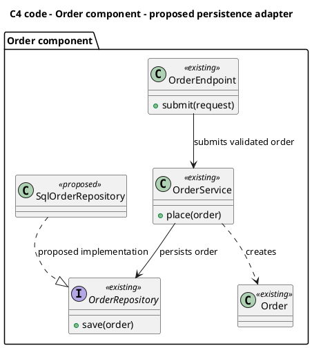
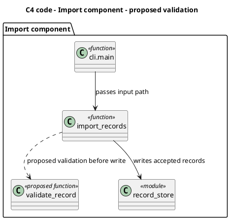

# C4 code diagrams

Each fitted slice requires a C4 code diagram, even when it needs no new ADR.
The [C4 code level](https://c4model.com/diagrams/code) shows code elements within a component through UML classes, entities, or equivalent notation.
A context, container, or component view alone does not satisfy this requirement.
The diagram describes the proposed structure, not an implementation task sequence.

- Use plain PlantUML class notation for classes, interfaces, modules, functions, and their dependencies.
- Identify the owning component in the title or enclosing package.
- Show the starting surface and affected code elements, including direct collaborators needed to explain the outcome.
- Use existing code names when available.
- Mark new elements and relationships as `proposed` until implementation verifies them.
- Label relationships with their purpose, such as validation, persistence, or event publication.
- Include public operations or boundary types only when they explain a consequential relationship.
- Leave private helpers, complete field lists, and algorithm choices to implementation.
- Keep rationale, alternatives, and consequences in the ADR instead of repeating diagram relationships in prose.
- Reuse an existing code diagram when it covers the affected structure.
- Check the source with an available PlantUML renderer before returning `FIT`.
- If rendering is unavailable, report that limitation in the result.

The examples use built-in PlantUML notation and need no remote includes or C4 macro library.
Names and relationships are illustrative, not required architecture.

## Class and interface example

This view shows a proposed persistence adapter within an existing order component.
The interface remains the boundary between the service and storage.

## Module and function example

Code views also apply to systems without classes.
The stereotypes identify modules and functions without requiring object-oriented implementation.

A separate sequence or state diagram can explain failure order or lifecycle rules that the static code view cannot show.
These additional views do not replace the required code diagram.
