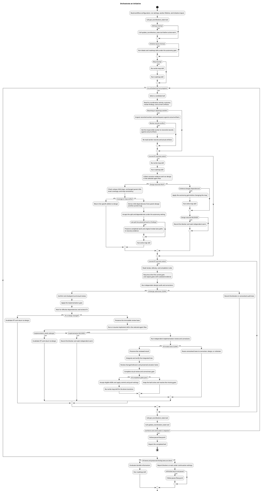

# Orchestrate an initiative

The [workflow terms](../workflow/SKILL.md#common-terms) define the shared lifecycle.
The diagrams own phase order, branches, and returns.
The prose defines inputs, constraints, and tool arguments.

## Core flow

The following PlantUML block defines the required orchestration process.
The [pause flow](references/pause-flow.puml) applies when unfinished work must pause.

## Inputs and coordination contracts

Required inputs are:
- `.prism/workflow.md`
- the roadmap initiative
- intent
- Approved requirements
- `map.puml`
- linked evidence when they exist.
The [run settings](references/run-settings.md) define decision gates and agent flow.
The [worker lifetime](references/worker-lifetime.md) rules define valid worker waits, resumes, and replacements.
The `get_coordination_state` input includes the initiative path, even when `state.json` does not exist.
The `update_coordination_state` input includes the current revision.
Settings resolution supplies `changes.settings`.
Initiative state updates supply current workers, blockers, next actions, and evidence paths.
Missing records establish neither approval nor completion.
The agent flow is immutable after active work starts.
Dependent work requires its applicable gate under the resolved autonomy setting.

## Design and worker invariants

The design worker receives ancestor diagram and ADR paths, including inherited paths.
Design can start before prerequisite implementation when available evidence supports it.
An existing `slice.md` supplies the design outcome record.
The configured `agentFlow` controls design and implementation routing.
In `multi` flow, the `Develop <slice>` worker receives requirements, map, workspace, settings, and ancestor paths.
The `Develop <slice>` worker remains available after `FIT` for implementation and corrections.
`write-map` receives the root title and complete Approved requirement assignment when no map exists.
`write-map` receives leaf status (`in-progress` or `done`), accepted child slugs, and dependency edges when they change.
The `roadmap` update receives status (`planned`, `in-progress`, or `shipped`) and the map path.

A valid `SPLIT` has unique child slugs, an unchanged parent title, and exact collective requirement coverage.
Child dependencies follow the parent design and map, and require acceptance under the autonomy setting.
An accepted split parent never executes again.
Its completion waits for all descendants and preserved findings.
Late splits preserve completed work and original review lane paths in recovery evidence.
A split result is persisted only when a later worker needs a fact that no existing artifact owns.

## Delivery invariants

Delivery requires a current `FIT` result.
The [review and correction rules](references/review-rules.md) apply to design audits and implementation reviews.
The [delivery rules](references/delivery-rules.md) define implementation constraints.
The [integration and completion rules](references/completion-rules.md) define integration and completion constraints.

## State and recovery invariants

The initiative's `state.json` records current coordination facts beside `map.puml`.
Typed `activeOperations` use `start`, `update`, `finish`, and `release`; only `finish` claims completion after the server checks current review evidence.
Activities are `design`, `implementation`, `review`, and `integration`, with descriptive labels stored separately.
The map alone owns slice topology, requirement assignments, dependencies, and status.
The orchestrator is the only workflow writer for initiative state.
Mono delivery records `orchestrator` as the active worker and the current workspace.
State evidence paths resolve from the note's directory unless absolute.
Empty lists mean no current item.
An old recovery note for an inactive parent slice is historical evidence, not an active pause failure.

The `checkpoint_pause` input includes the current revision, active slice, recovery content and path, and state changes.
The fallback `update_coordination_state` input includes the current revision, recovery path, and state changes.
The fallback applies only when `checkpoint_pause` is unavailable and the other coordination-state tools work.
A completed pause requires recovery and state updates.
Replacement workers need retained recovery and ancestor evidence after compaction or handoff.
Older coordination files remain until their required information has a durable home.
Conversation-only facts belong in the owning slice folder only when a later worker needs them.
The [delegation procedure](../workflow/references/delegation.md) governs child-worker delegation.

- Don't
  - Create user-owned tasks as child-agent substitutes.
