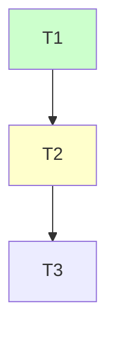

# Plan an initiative

This is the **plan**, one altitude above `/design` + `/implement`: it takes a body of work spanning several ADRs and decomposes it into **tracks**, each of which then becomes its own design → implement cycle.
You run **inline with the user** and delegate the ADR/codebase reading to **subagents**, keeping your context lean.

Project settings for this workflow live in `.claude/workflow-config.md` at the project root (created by the `workflow-init` skill). Read it first if it exists; it overrides the default paths below. If absent, use the defaults and the project's own CLAUDE.md conventions.

Run this only when the work is genuinely multi-track.
A single self-contained feature does not need a plan — start it at its ADR with `/design`.

**One workflow skill per session** (the rule and its rationale live in the `workflow` overview skill).
The nuance here: do not roll into `/design` or `/implement` once the plan is accepted — each track's design starts in a fresh session.

The job is **build-ordering, not phasing.**
The architecture is settled (or settling) in the ADRs; this plan decides *what order to build it in so no work dead-ends*.
It is **not** a v1/v2 rollout — the architecture lands end-to-end.
The ordering is *forced by dependency*, never *chosen by priority* (priority-ordering of whole initiatives is a roadmap, one rung up, and out of scope here).

Read first: the glossary (default `/docs/Glossary.md`) and the ADR cluster this initiative implements (default `/docs/ADRs/`).

## 1. Frame the initiative

Settle with the user: the scope, which ADRs it sequences, what it *serves* (its
roadmap node and, if the project has a strategy document, the pillar that node advances — cite both), and what "first release" means.
If this initiative has no roadmap node yet, add one (`/roadmap <initiative>`, Mode B) as part of framing.
ADRs and the plan **co-evolve**: if decomposition surfaces an undecided question, that is a missing ADR — feed it back (load `write-adr`), don't bury the decision in the plan.

## 2. Decompose into tracks

Carve the work into tracks where **each track is one `/design` + `/implement`
unit** — coarse enough to be a coherent capability, fine enough to be specifiable.
A deliverable that is itself design-worthy is its own track.
Delegate the ADR reading to subagents (pass paths, not contents) to *propose* a decomposition; integrate it inline — this carving is the load-bearing judgment of the whole session.

## 3. Order by dependency

Build the dependency DAG as **Mermaid** (`graph TD`) in the spine.
This is the load-bearing artifact: it answers "what must exist before what."
It is also the **live status board** — style nodes by status with `classDef`, and the implementer flips a node's class as each track lands.
Keep the edges authoritative *here only*;
track files describe their dependencies in prose for the reader, not as a second source of truth.

## 4. De-risk before committing

Two sections the per-track flow has no analog for — this is where the altitude earns its keep:

- **Ordering spikes.**
  Bounded (~1 day) investigations whose finding could change the track list or a DAG edge.
  Each names what must be learned and what its finding would change.
  **You own these** — a spike that gates the ordering must resolve *before the plan gate*, so run it (delegate the legwork to a subagent) and fold
  its finding into the decomposition before presenting the plan.
  Do not ship an ordering an unrun spike could invalidate.
  (A spike whose finding would reshape only *one* track's spec — not the ordering — is a **track-feasibility spike**: name it here for the affected track, but it is the **design session** that runs it, before that track's design gate.
  The Spikes section of the spine template below is the authoritative statement of this ownership split.)
- **Operational pre-work.**
  Work with external lead time (certificate enrollment, key custody, third-party approvals, data-curation commitments) — unlike a spike, it does not gate the ordering's *correctness*, so start it day one regardless of engineering and name what each gates; it runs *after* plan acceptance.

## 5. Define release readiness

State the **minimum track subset** for a first ship, and what is purely additive (lands after without breaking the experience).
For an initiative whose point is "what must we build to ship," this is the most important output — make it a checklist, not a paragraph.

## 6. Write the plan

Author the folder `<plans dir>/<initiative>/` yourself (plans dir default `/docs/plans/`; this is one coherent artifact, not parallelizable): the spine `plan.md` plus one `<track>.md` per track, using the templates below.

---

## The artifact

`<plans dir>/<initiative>/` — **scratch but long-lived**: status churns as tracks land;
the whole folder is deleted only when the last track lands, behind the graduate-before-delete gate (rule in the `workflow` overview skill's "Cross-session lifecycles"; mechanics in `implement`'s last-track gate).
Each track's `/design` session nests its prep bundle inside as `<plans dir>/<initiative>/<track>/`.

### Spine — `plan.md`

````markdown
# <Initiative> — plan

Serves: <its roadmap node> → <the strategy pillar it advances, if the project names pillars>.
Sequences ADRs <list> into dependency-ordered tracks.
This is a build-order plan, **not** a phased rollout — the architecture lands end-to-end;
the order exists only to avoid dead-end work.

## Tracks


The DAG is the single source of truth for both dependency edges and live status —
flip a node's class as it lands (unstyled = not started).

Track index: one line each, linking `<track>.md`.

## Open questions

Each resolves to a track, an ADR, or explicitly out-of-scope — with status. Never an indefinite parking lot.

## Operational pre-work

Work with external lead time — start day one, runs after plan acceptance.
Each with what it gates.

## Spikes

Bounded (~1 day) investigations that de-risk a decision before its gate.
Each: what we must learn, what its finding would change, and **who runs it** — an *ordering* spike (could change the track list or a DAG edge) resolves here, before the plan gate;
a *track-feasibility* spike (reshapes one track's spec only) is named against its track and run by that track's design session.

## Cross-cutting concerns

Items spanning tracks.
Each MUST resolve to a track, an ADR, or explicitly out-of-scope **before the plan is deleted** — nothing here survives by being "noted".

## Release readiness

The minimum track subset for a first ship, as a checklist;
and what is purely additive.
````

### Track file — `<track>.md`

```markdown
# <Initiative> / <track> — <name>

**Goal.**
One line: what exists when this track is done.

**Deliverables.**
The concrete units; each is `/design`-able.

**Dependencies.**
Which tracks land first (the spine DAG is authoritative;
this is prose for the reader).

**Risk.**
Each risk names a **failure mode AND its detector** — a spike or a test.
A risk without "what could go wrong + what catches it" is a vibe, not a risk.

**Spike findings.**
What this track's spikes surfaced that reshaped these deliverables — an ordering spike's finding is filled by the planning session before the plan gate;
a track-feasibility spike's by the design session before the design gate.

**Status.**
not-started / in-progress / blocked / deferred / done — kept in sync with the spine's Mermaid node.
*Design* flips it `→ in-progress` when it starts the track;
*implementation* flips it `→ done` at landing; either sets `blocked`/`deferred` (with a reason) when a dependency or decision actually stalls it.
```

---

## Conventions

- **Order by dependency, never priority.**
  If you catch yourself sequencing by "what's most valuable," that's a roadmap decision, not a plan one.
- **Size is provisional; integration is a track.**
  You hold the decisions, not their realization cost — a track's size is a best guess, corrected downstream: `design`'s right-size check splits an over-sized track before implementation, and `implement`'s gate re-scopes unfinished work into a follow-up track.
  Don't over-invest in precision you can't have.
  But two things you *can* get right from the ADRs: give foreseeable **cross-process / cross-surface integration its own track** (never fold a net-new cross-cutting capability into a feature track because that's where its consumer lives), and never let the **terminal track become the catch-all** — a loose end too big to finish in one session is itself a track, not a footnote on the last one.
  "In scope because it's the last track" is the smell that you've done exactly that.
- **Mermaid, not ASCII** — it renders and diffs.
  The DAG is also the status board.
- **Every risk has a detector.**
  No bare "Risk: medium".
- **Parking lots must resolve.**
  Open questions and cross-cutting concerns each route to a track, an ADR, or explicit out-of-scope — because the plan gets deleted, and anything not graduated is lost.
- **Cite ADRs, not track labels, in anything durable.**
  Track IDs (`T7`) are scratch.

## Gate

Stop and present the plan.
**Design no track yet.**
Wait for the user to accept before any track enters `/design`.
On acceptance, flip this initiative's roadmap node `envisioned → planned` (gains its ADRs + the plan deep-link) — a one-line edit per the roadmap's Mode B; no separate gate.
