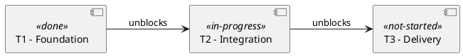

# Plan an initiative

This is the **plan**, one altitude above `design` and `implement`.
It takes a body of work spanning several Approved requirement files and decomposes it into **tracks**.
Each track then becomes its own design → controlled implementation cycle.
Run inline with the user and delegate requirement, ADR, and codebase reading to child agents when available.

Project settings for this workflow live in `.prism/workflow.md` at the project root (created by the `workflow-init` skill).
Read it first if it exists.
It overrides the default paths and stack assumptions below.
If absent, use the defaults and the project instructions that apply to this task.
The context map and lifecycle rules live in the `workflow` overview skill.

Run this only when the work is genuinely multi-track.
A single self-contained feature does not need a plan.
Start it at its Approved requirement file with `design`.

**One workflow skill per context** (the rule and its rationale live in the `workflow` overview skill).
Do not run `design` or `implement` in this context after the plan is accepted.
Each track design starts in a fresh context.

The job is **build-ordering, not phasing.**
The product obligations are settled in Approved requirements.
Accepted ADRs constrain the available design space.
This plan decides *what order to build it in so no work dead-ends*.
It is **not** a v1/v2 rollout, because the architecture lands end-to-end.
The ordering is *forced by dependency*, never *chosen by priority* (priority-ordering of whole initiatives is a roadmap, one rung up, and out of scope here).

Read the glossary first, with `docs/Glossary.md` as the default path.
Then read the Approved requirement files and relevant ADRs, with `docs/requirements/` and `docs/ADRs/` as the default directories.

## 1. Frame the initiative

Settle the scope, the Approved requirements, what the initiative serves, and what "first release" means.
For what it *serves*, cite both its roadmap node and the strategy pillar that node advances.
If the project has no strategy document, say so explicitly rather than silently skipping the pillar.
If this initiative has no roadmap node, use `roadmap` Mode B to add one during framing.
Do not change requirements in this context when decomposition exposes a missing product obligation.
Route a missing or wrong obligation back to `write-requirements` and user approval.
If decomposition requires a cross-track architectural decision, load `write-adr` and create a Proposed ADR.
Do not bury a product obligation or architectural decision in the plan.

## 2. Decompose into tracks

Carve the work into tracks where **each track is one coherent technical design unit**.
Each track is coarse enough to hold one architectural argument and fine enough to specify without independent design branches.
A capability that can change its architecture independently is its own track.
Do not split a track only because implementation will need several tasks, workers, or contexts.
Each track must cite the Approved requirements that define its product obligations.
Delegate requirement and ADR reading to child agents when available.
Pass paths, not contents, and ask them to propose a decomposition.
Integrate it inline, because this carving is the load-bearing judgment of the whole session.

## 3. Order by dependency

Build the dependency DAG as PlantUML in `tracks.puml` beside the spine.
This is the load-bearing artifact: it answers "what must exist before what."
It is also the **live status board**: give each component a status stereotype, and the implementer updates it as each track lands.
Keep the edges authoritative *here only*.
Track files describe their dependencies in prose for the reader, not as a second source of truth.

## 4. De-risk before committing

Two sections the per-track flow has no analog for, and this is where the altitude earns its keep:

- **Ordering spikes.** Bounded (~1 day) investigations whose finding could change the track list or a DAG edge.
  Each names what must be learned and what its finding would change.
  Use a spike for an uncertain dependency, not as a substitute for detailed design.
  **You own these.**
  Resolve an ordering spike before the plan gate and delegate legwork to a child agent when available.
  Do not ship an ordering an unrun spike could invalidate.
  (A spike whose finding would reshape only *one* track's spec, not the ordering, is a **track-feasibility spike**: name it here for the affected track, but it is the **design session** that runs it, before that track's design gate.
  The Spikes section of the spine template below is the authoritative statement of this ownership split.)
- **Operational pre-work.** Work with external lead time (certificate enrollment, key custody, third-party approvals, data-curation commitments).
  Unlike a spike, it does not gate the ordering's *correctness*, so start it day one regardless of engineering and name what each gates.
  It runs *after* plan acceptance.

## 5. Define release readiness

State the **minimum track subset** for a first ship, and what is purely additive (lands after without breaking the experience).
For an initiative whose point is "what must we build to ship," this is the most important output, so make it a checklist, not a paragraph.

## 6. Write the plan

Author `<plans dir>/<initiative>/` yourself, with `docs/plans/` as the default plans directory.
Write the spine `plan.md` and one `<track>.md` file per track from the templates below.

---

## The artifact

`<plans dir>/<initiative>/` is **scratch but long-lived**: status churns as tracks land.
The whole folder is deleted only when the last track lands, behind the graduate-before-delete gate (rule in the `workflow` overview skill's "Cross-session lifecycles", mechanics in `implement`'s last-track gate).
Each track's `design` task nests its prep bundle inside `<plans dir>/<initiative>/<track>/`.

### Spine: `plan.md`

````markdown
# <Initiative> - plan

Serves: <its roadmap node> → <the strategy pillar it advances>.
If the project has no strategy document, write "no strategy document" instead of omitting this line.
Sequences Approved requirements <links> into dependency-ordered tracks.
Architectural constraints: <relevant ADR links, or "none">.
This is a build-order plan, **not** a phased rollout because the architecture lands end-to-end.
The order exists only to avoid dead-end work.

## Tracks

[Track dependency and status diagram](tracks.puml)

The PlantUML DAG is the single source of truth for dependency edges and live status.
Use one component per track and a status stereotype on every component.
Use `not-started`, `in-progress`, `blocked`, `deferred`, or `done`.

Track index: one line each, linking `<track>.md`.

## Open questions

Each resolves to a requirement, track, ADR, or explicitly out-of-scope item with status.
Never keep an indefinite parking lot.

## Operational pre-work

Work with external lead time - start day one, runs after plan acceptance.
Each with what it gates.

## Spikes

Bounded (~1 day) investigations that de-risk a decision before its gate.
Each states what we must learn, what its finding would change, and **who runs it**.
An *ordering* spike can change the track list or a DAG edge and resolves before the plan gate.
A *track-feasibility* spike reshapes one track and runs in that track's design session.

## Cross-cutting concerns

Items spanning tracks.
Each MUST resolve to a requirement, track, ADR, or explicitly out-of-scope item before the plan is deleted.
Nothing survives by being only noted here.

## Release readiness

The minimum track subset for a first ship, as a checklist.
State what is purely additive.
````

### Track file: `<track>.md`

```markdown
# <Initiative> / <track> - <name>

**Goal.**
One line: what exists when this track is done.

**Requirements.**
Direct links to every Approved requirement this track serves.

**Design boundary.**
The coherent capability and the architectural boundary that this design owns.

**Dependencies.**
Which tracks land first.
The spine DAG is authoritative, and this field is prose for the reader.

**Risk.**
Each risk names a **failure mode AND its detector** - a spike or a test.
A risk without "what could go wrong + what catches it" is a vibe, not a risk.

**Spike findings.**
State what the track's spikes surfaced that changed these deliverables.
The planning session records an ordering spike before the plan gate.
The design session records a track-feasibility spike before the design gate.

**Status.**
not-started / in-progress / blocked / deferred / done - kept in sync with the spine's PlantUML component stereotype.
*Design* flips it `→ in-progress` when it starts the track.
The implementation controller flips it `→ done` after track correctness confirmation.
Either session sets `blocked` or `deferred` with a reason when a dependency or decision stalls it.
```

---

## Conventions

- **Order by dependency, never priority.** If you catch yourself sequencing by "what's most valuable," that is a roadmap decision, not a plan one.
- **Design boundaries are provisional, but implementation size is not a track boundary.** You hold the decisions, not their realization cost.
  `design` can split a track when technical analysis finds independent design capabilities or incompatible architectural boundaries.
  `design` expresses implementation size as a dependency-ordered task graph inside the track.
  Do not predict detailed implementation effort before the technical design exists.
  Two structural checks still belong here.
  First, expose each cross-process or cross-surface dependency and test whether it creates an incompatible architectural boundary.
  Second, never let the terminal track become a catch-all for independent design capabilities.
  Move an item only when it needs its own architectural argument, not because it needs more implementation tasks.
- **PlantUML source, not ASCII or images.** Store the DAG in `tracks.puml` and link it from the spine.
The DAG is also the status board.

Use this shape for `tracks.puml`:


```plantuml
@startuml
left to right direction
component "T1 - Foundation" as T1 <<done>>
component "T2 - Integration" as T2 <<in-progress>>
component "T3 - Delivery" as T3 <<not-started>>
T1 --> T2 : unblocks
T2 --> T3 : unblocks
@enduml
```
- **Every risk has a detector.** No bare "Risk: medium".
- **Parking lots must resolve.** Open questions and cross-cutting concerns each route to a requirement, track, ADR, or explicit out-of-scope item.
  The plan gets deleted, so anything not graduated is lost.
- **Cite requirements for obligations and ADRs for decisions.** Never cite a track label from a durable artifact.
  Track IDs such as `T7` are scratch.

## Gate

Stop and present the plan.
When `present_review` is available, open the returned URL in the host internal browser and inspect `plan.md` and its dependency diagram before asking for acceptance.
**Design no track yet.**
Wait for the user to accept before any track enters `design`.
Deliver that acceptance question, and any scoping fork the plan raises, per **"How to deliver the question"** in the `workflow` overview skill.
On acceptance, flip this initiative's roadmap node `envisioned → planned` and add its requirements, ADRs, and plan link.
This is a one-line edit per the roadmap's Mode B, with no separate gate.
