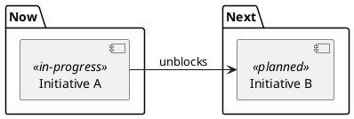

# Maintain the roadmap

This is the rung **one altitude above `plan`**.
It orders whole initiatives by priority, which `plan` does not do.
It never defines how to build one initiative.

Project settings for this workflow live in `.prism/workflow.md` at the project root (created by the `workflow-init` skill).
Read it first if it exists.
It overrides the default paths and stack assumptions below.
If absent, use the defaults and the project instructions that apply to this task.
The context map and lifecycle rules live in the `workflow` overview skill.

The artifact is the roadmap file (default `docs/roadmap.md`), a single **durable, living** file.
Unlike the one-shot skills, the roadmap is **not** authored once: it is revisited continuously as new information arrives.
So this skill has **two modes**, and you state which you are in up front.

Read the roadmap, the product strategy document if present, and the glossary (default `docs/Glossary.md`).

## Mode A: re-prioritization (a gated `roadmap` task)

The judgment-heavy mode.
Run **inline with the user**.
Delegate the read-heavy survey to a child agent when available, and keep the prioritization call inline.

1. **Orient.** Read the current roadmap and the strategy pillars it serves.
   Confirm which initiatives are live, shipped, or newly envisioned, and delegate this survey to a child agent when available.
2. **Re-band.** Move initiatives between **Now / Next / Later** by priority *given* cross-initiative dependency.
   Band (priority) and arrow (dependency) are orthogonal.
   Keep both visible, and never collapse to one axis.
   Sequencing whole initiatives is **not** phasing a design (see Conventions).
3. **Check band load, sub-order if overloaded.** A band, especially **Now**, feeds a finite delivery lane (tracks are built one per session, so the lane clears only as fast as that cadence allows).
   When a band holds more concurrent initiatives than that lane can actually advance, breadth *is* the risk: everything inches and nothing ships.
   Surface the overload explicitly, then add an explicit **within-band order**.
   This is a finer priority call than the band itself, answering "finish which before starting which."
   Favor initiatives that **unblock downstream nodes** (dependency-aware priority, see **Prioritization lenses**).
   Record it in the sequencing rationale.
   This is still priority, not a schedule and not phasing (see Conventions).
4. **Add envisioned work.** New ideas enter as `envisioned` nodes (dashed, just name + intent + the pillar served).
   A node is usually requirement-free until `ideate` or `write-requirements` defines its product obligations.
   An idea shaped by `ideate` MAY enter with its Approved requirement links.
   The `ideate` skill never writes the roadmap itself.
   You attach those requirements when you band the node.
5. **Park, do not drop.** De-prioritized work moves to `parked` with a recorded reason.
   Shipped nodes stay (the roadmap is also the ledger of what got built).
6. **Resolve open questions.**
   Route each strategic question to a banding decision, requirement task, or ADR.
   Never keep an indefinite parking lot.

**Gate:** present the re-banded roadmap, and the user accepts before you write it.
Deliver this gate, and any banding fork you cannot resolve from the lenses, per **"How to deliver the question"** in the `workflow` overview skill.
This applies to Mode A only.
Mode B is ungated and asks the user nothing.

## Mode B: state flip (fired inside another session, no gate)

A one-line color change bound to a lifecycle event that already passed its own gate.
**No new gate.** Re-gating an event that already happened is ceremony.
The flips:

- `plan` accepted: envisioned → planned (add requirements, ADRs, and the `click` plan link).
- First track enters `design`: planned → in-progress.
- Last track lands (plan folder deleted): in-progress → shipped (remove the `click` link).

If the initiative is not yet a node (it was started without ever being roadmapped), **add it** in `Now`, since it is being worked.
A self-contained feature without `plan` is one track with a node that cites its requirements and any ADRs.

## Prioritization lenses

Banding and the within-band sub-order (step 3) are **qualitative** calls.
On a roadmap without real usage data or a large scored backlog, reach and effort numbers would be invented.
Three lenses, in the order you reach for them:

- **Dependency-aware, first.** The forced lens: favor the initiative whose completion *unblocks the most downstream nodes*.
  The graph already encodes it, so read the arrows before any softer judgment.
- **MoSCoW, to scope a loaded band.** Make each initiative earn its place: **Must** (the band fails without it) stays, **Should / Could** drop a band down, and **Won't, this cycle** goes to `parked` with a reason.
  This is the discipline behind "what comes off?".
  Adding to a band without demoting something is how a finite lane silently overcommits.
- **Value vs effort, to spot quick wins.** Within a band, pull near-done, low-effort, high-value nodes forward to bank progress and release the bundle.
  Name any high-effort, low-value node as a candidate to **park**, not sequence.

**Deferred on purpose: RICE and ICE.**
Both need *Reach* and *Effort* numbers (users per period, person-months).
Without real usage data, those are fiction, the same reason this skill bans dates.
Adopt them once there is real usage data and a backlog large enough to need scoring.
Until then a score only launders guesses into false confidence.

## Writing the artifact

Update the roadmap file in place.
Store the central PlantUML dependency graph in `roadmap.puml` beside the roadmap file.
Link it from the roadmap with `[Roadmap diagram](roadmap.puml)`.
The graph is the single source of truth for priority bands, initiative states, and cross-initiative dependency edges.
Use packages for Now, Next, Later, Parked, and Shipped when those groups contain nodes.
Use stereotypes for `envisioned`, `planned`, `in-progress`, `shipped`, and `superseded` states.
Label each dependency arrow with `requires` or `unblocks` so its direction is clear.
Do not keep a separate cross-initiative dependency table.
Keep the section list: header and `Serves`, roadmap diagram link, initiative index, sequencing rationale, parked and superseded context, open strategic questions, and lifecycle.
The prose owns strategy alignment, rationale, overload risks, and open questions.

Use this shape as the starting point:

## Conventions

- **Priority + dependency, both visible.** The band is priority (your call), and the arrow is dependency (forced).
  Never collapse them, because that is the whole reason this is a `graph`, not a list or a Gantt.
- **No dates.** The horizon is the band, not a calendar axis.
  Durations on a bursty, agent-driven cadence are fiction.
- **Sub-order a loaded band.** The band is the coarse priority, and the **delivery lane is finite**.
  When one band (typically Now) holds more concurrent initiatives than that lane can advance, add an explicit **within-band order** in the sequencing rationale and flag the overload.
  Running everything at once means nothing ships.
  It is a finer priority call, not a schedule and not phasing.
  Favor initiatives that **unblock downstream nodes** so finishing one releases the most work.
  The within-band order lives in the sequencing-rationale prose, not as new bands or dates.
- **Cite requirements, ADRs, and names, never plan IDs.** A node's durable identity includes its name, requirements, decisions, and strategy pillar.
  The `click` plan deep-link is the lone tolerated reference to scratch, dropped on ship.
- **Sequencing initiatives ≠ phasing a design.** "No phased designs" governs the architecture *inside* one initiative (it lands whole).
  Ordering whole initiatives over time is this roadmap's entire job and does not violate that rule.
- **Anti-rot gate.** A plan folder may not be deleted until its roadmap node is `shipped` (rule in the `workflow` overview skill's "Cross-session lifecycles", enforced by `implement`'s last-track gate).
  The state column is therefore mechanically incapable of lying.
- **PlantUML source, not ASCII or images.** Read and update `roadmap.puml` directly.
- **No Gantt without real schedule data.** Never invent dates or durations for a diagram.
- **No EBNF for roadmap content.** EBNF describes a file grammar and does not show current initiatives.

## Gate

Mode A: stop and present the re-banded roadmap, and wait for the user to accept before writing.
When `present_review` is available, open the roadmap review page before the acceptance question.
Mode B: no gate, because the flip is bound to an event that already cleared one.
