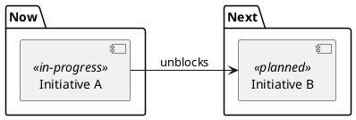

# Maintain the roadmap

This skill works one level above `plan`.
It prioritizes whole initiatives without defining their implementation.

The roadmap is one durable, living file at the configured path.
The default roadmap path is `docs/roadmap.md`.

## 1. Prepare

1. Read `.prism/workflow.md` when it exists.
2. When `.prism/workflow.md` exists, use its paths and stack assumptions instead of the defaults.
3. When `.prism/workflow.md` does not exist, use the defaults and applicable project instructions.
4. Read the `workflow` skill for lifecycle rules and the context map.
5. Read the roadmap, the glossary, and the product strategy document when present.
6. When `orchestrate` requests a listed state transition after its related gate, select orchestrated state-change mode.
7. Otherwise, select re-prioritization mode.
8. State the selected mode before continuing.
9. Follow only that mode's actions.

The default glossary path is `docs/Glossary.md`.

## 2. Prepare and apply the prioritization lenses

Re-prioritization is a judgment-heavy, gated task that runs inline with the user.
Re-prioritization and orchestrated state-change mode are mutually exclusive.
This section applies only in re-prioritization mode.

1. Read [delegation.md](../workflow/references/delegation.md).
2. Route a bounded read-only survey through that procedure.
3. Confirm which initiatives are live, shipped, or newly envisioned.
4. Read the strategy pillars that these initiatives serve.
5. Keep the prioritization decision in the current context.
6. Use qualitative judgment unless real usage data and a large scored backlog exist.
7. Read dependency arrows first.
8. Favor the initiative that unblocks the most downstream nodes.
9. Use MoSCoW to reduce an overloaded band.
10. Keep `Must` initiatives that the band cannot succeed without.
11. Move `Should` and `Could` initiatives to a later band when capacity requires it.
12. Move `Won't, this cycle` initiatives to `parked` with a reason.
13. When adding work to a full band, demote other work to preserve finite capacity.
14. For each applicable band, use value versus effort to find quick wins within that band.
15. Move near-complete, low-effort, high-value initiatives forward within an applicable band when this releases useful progress.
16. Identify high-effort, low-value initiatives as parking candidates.

- Don't
  - Use RICE or ICE without real reach and effort data.

Invented scores create false confidence.

## 3. Re-prioritize the roadmap

This section applies only in re-prioritization mode and follows the prioritization lenses.

1. Apply the prioritization lenses to every proposed band change.
2. Reassign initiatives among `Now`, `Next`, and `Later` by priority and cross-initiative dependency.
3. Keep priority bands and dependency arrows visible as separate axes.
4. When a band exceeds delivery capacity, state the overload and add a within-band order.
5. When a band exceeds delivery capacity, record the within-band order in the sequencing rationale.
6. Add new ideas as dashed `envisioned` nodes with only a name, intent, and served pillar.
7. When `ideate` shaped an idea, attach its Approved requirement links while banding the node.
8. Move de-prioritized work to `parked` and record the reason.
9. Keep shipped nodes as the ledger of completed work.
10. Route each strategic question to a banding decision, requirement task, or ADR.
11. Do not keep an indefinite question list.
12. Prepare the proposed roadmap and diagram without updating either durable file.

An `envisioned` node usually has no requirements until `ideate` or `write-requirements` defines them.
The `ideate` skill does not write the roadmap.
Within-band order is priority, not a schedule or a phased design.

## 4. Apply an orchestrated state change

This mode performs one state change requested by `orchestrate` after its related gate passes.
This mode has no new gate and asks the user no questions.
This mode changes no other roadmap lifecycle state.
The procedure applies exactly one requested state transition.

1. Skip all re-prioritization actions, including prioritization lenses, visual review, and user acceptance.
2. When the initiative has no node, add it to `Now` in the source state for the requested transition.
3. For a self-contained outcome without `plan`, make the node cite its requirements and any ADRs.
4. When a plan is accepted, change `envisioned` to `planned`.
5. When a plan is accepted, add requirements, ADRs, and the `click` plan link.
6. When the first slice enters `design`, change `planned` to `in-progress`.
7. When the last slice lands, change `in-progress` to `shipped`.
8. When the last slice lands, remove the `click` plan link.
9. Update only the files required for the requested transition and its listed link or node changes.

## 5. Review, accept, and write the re-prioritization

This section applies only in re-prioritization mode.

1. Inspect the rendered proposed diagram through [visual-review.md](../workflow/references/visual-review.md) without updating either durable file.
2. Present the proposed roadmap and unresolved banding choices through the gate delivery rules in `workflow`.
3. Wait for user acceptance.
4. After acceptance, update the roadmap file and store the accepted `roadmap.puml` beside it.

## 6. Maintain the artifact format

- Link the diagram from the roadmap as `[Roadmap diagram](roadmap.puml)`.
- Treat the graph as the source of truth for bands, states, and dependency edges.
- Use packages for nonempty `Now`, `Next`, `Later`, `Parked`, and `Shipped` groups.
- Use stereotypes for `envisioned`, `planned`, `in-progress`, `shipped`, and `superseded` states.
- Label each dependency arrow `requires` or `unblocks` to show its direction.
- Keep the header and `Serves`, roadmap link, initiative index, sequencing rationale, parked context, superseded context, open questions, and lifecycle.
- Keep strategy alignment, rationale, overload risks, and open questions in prose.

## 7. Follow the conventions

- Do
  - Show priority with bands and dependency with arrows.
  - Add a within-band order when a band exceeds delivery capacity.
  - When a band exceeds delivery capacity, put the within-band order in the sequencing rationale.
  - Keep requirements, ADRs, names, and strategy pillars as durable node identity.
  - Keep the `click` plan link only until the initiative ships.
  - Sequence whole initiatives independently from architecture inside an initiative.
  - Read and update PlantUML source directly.
- Don't
  - Add or infer dates or durations anywhere in the roadmap or diagram.
  - Use a Gantt chart.
  - Collapse priority and dependency into one axis.
  - Represent within-band order as new bands or dates.
  - Keep a separate cross-initiative dependency table.
  - Cite plan IDs as durable node identity.
  - Delete a plan folder before its roadmap node is `shipped`.
  - Use ASCII art, rendered images, or EBNF for roadmap content.
