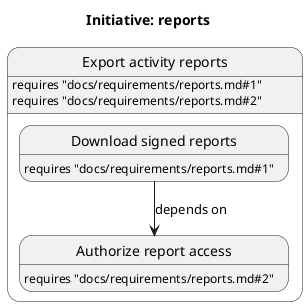

# Initiative map format

The map owns slice titles, hierarchy, requirement assignments, dependencies, and structural status.
Design proposes slice outcomes and titles, while orchestration owns parent relationships and dependencies.
The `write-map` skill applies orchestrator-supplied updates after any required acceptance.

## Constrained PlantUML

The grammar permits only the lines shown, blank lines, and indentation.
Labels and requirement references use JSON string escaping on one source line.
Aliases encode the exact slug UTF-8 bytes as lowercase hexadecimal after `s_`.
Slugs use letters, digits, hyphens, and underscores.
Repeated titles are valid because aliases identify slices.

- Sort sibling states, requirement lines, and dependency edges by slug and requirement reference.
- Preserve accepted titles and requirement references exactly.
- Run `node <plugin>/skills/write-map/scripts/validate-map.mjs <map.puml>` before replacing the map.
- Reject syntax outside this subset.
- Keep worker IDs, gates, findings, evidence, and phase metadata outside the map.

## Graph invariants

There is exactly one root with the complete Approved initiative requirement assignment.
Every slice has a nonempty title and requirement assignment.
Each parent's direct children cover exactly its assignment, with shared references allowed.
Only accepted splits add children.
A parent remains `split` permanently and cannot execute.
Leaf statuses are `not-started`, `in-progress`, `blocked`, `deferred`, and `done`.
Orchestration supplies dependency changes after their required acceptance.

Dependencies point from the dependent slice to its prerequisite.
Every leaf inherits ancestor dependencies.
A dependency on a parent expands to all descendant leaves.
The expanded graph has no self-dependency or cycle.
All descendant leaves must be `done` for aggregate completion.
Blocked and deferred leaves are incomplete.

The validator checks syntax, hierarchy, assignments, aliases, statuses, and expanded dependencies.
It returns parsed slices, effective dependencies, completion, and candidate design leaves.
It cannot prove approval, fit, finding closure, or verification.
Orchestration checks that evidence before admitting implementation or confirming completion.
Design can start before implementation dependencies complete.
