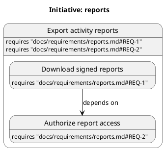

# Initiative map format

The map is the durable source for slice titles, hierarchy, requirement assignments, dependencies, and structural status.
Design owns proposed boundaries and meaningful titles.
The `write-map` skill applies only an accepted proposal or orchestrator lifecycle transition.

## Constrained PlantUML

The grammar permits only the lines shown, blank lines, and indentation.
Labels and requirement references use JSON string escaping on one source line.
Aliases encode the exact slug UTF-8 bytes as lowercase hexadecimal after `s_`.
Slugs use letters, digits, hyphens, and underscores.
Thus `a-b`, `a_b`, and `a_b_2` have distinct aliases.
The state label contains the accepted human title, rather than its identifier.
Repeated titles remain valid because aliases determine identity.

- Sort sibling states, requirement lines, and dependency edges by slug and requirement reference.
- Preserve accepted titles and requirement references exactly.
- Run `node <plugin>/skills/write-map/scripts/validate-map.mjs <map.puml>` before replacing the map.
- Reject syntax outside this subset instead of interpreting hidden comments or arbitrary PlantUML.
- Keep worker IDs, gates, findings, evidence, and phase metadata outside the map.

## Graph invariants

There is exactly one root slice.
Every slice has a nonempty title and requirement assignment.
The root assignment contains the complete Approved initiative requirement set.
Each parent's direct children cover exactly its assignment, with shared assignments allowed.
A parent has status `split` permanently and cannot execute.
Leaf statuses are `not-started`, `in-progress`, `blocked`, `deferred`, and `done`.
Only accepted design splits add children.
Only accepted design dependency amendments or splits change dependency edges.

Dependencies point from the dependent slice to its prerequisite.
Every leaf inherits dependencies from its ancestors.
A dependency on a parent expands to all descendant leaves.
The expanded graph has no self-dependency or cycle.
A parent is complete when all descendant leaves are `done`.
Blocked and deferred leaves are incomplete.

The validator parses this grammar and checks hierarchy, assignments, aliases, statuses, and expanded dependencies.
It returns parsed slices, effective dependencies, completion, and candidate design leaves.
It cannot prove approval, fit, or successful verification.
The orchestrator checks phase evidence before admitting an implementation frontier member.
New design candidates can start before their dependencies complete.
